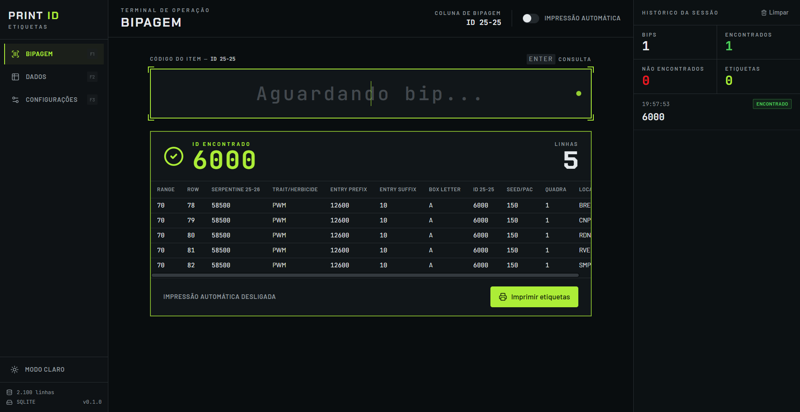
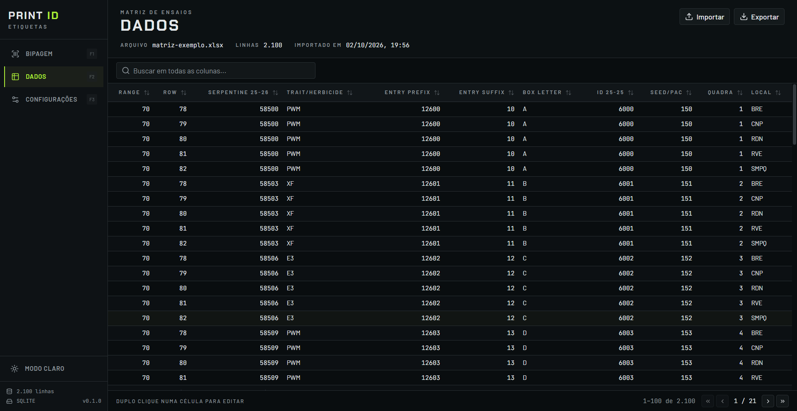
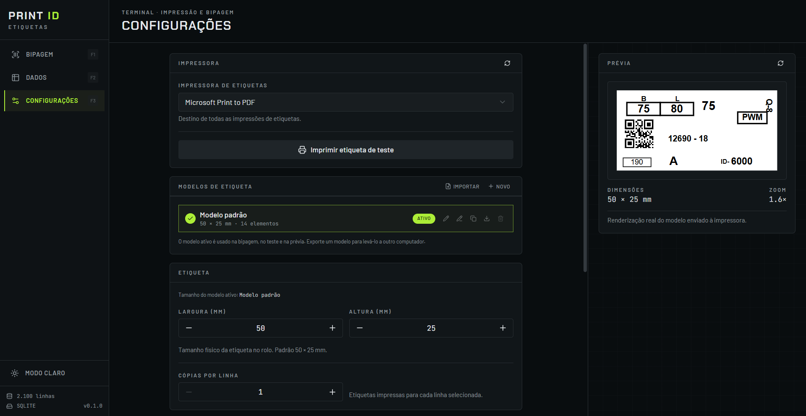
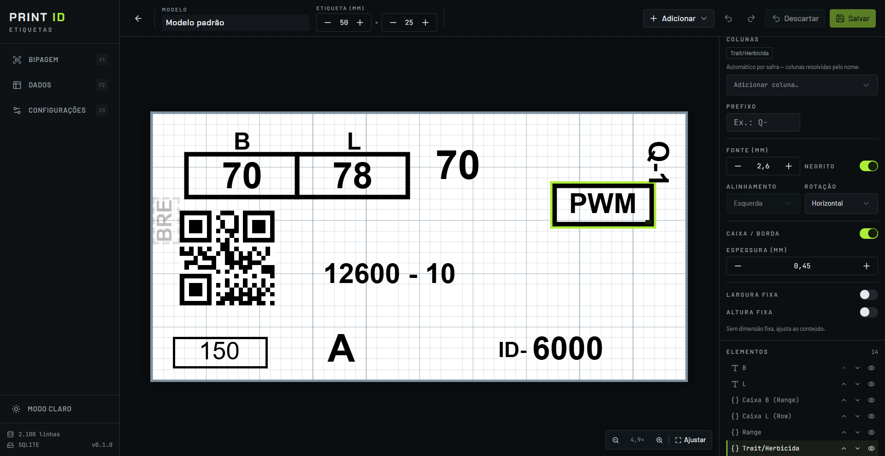

# Print ID

App desktop (Windows) para **imprimir etiquetas de ensaios agrícolas a partir de uma planilha**.

O fluxo de uso é simples:

1. Você importa a matriz de ensaios (`.xlsx`, `.xls` ou `.csv`).
2. Na tela de **Bipagem**, o operador lê um código de barras com o leitor.
3. O app encontra todas as linhas daquele ID (normalmente 5 — uma por local) e **imprime as etiquetas automaticamente**.


_A etiqueta física que o app imprime._

---

## Sumário

- [Começando](#começando)
- [As telas](#as-telas)
- [Como o app funciona](#como-o-app-funciona)
- [Scripts disponíveis](#scripts-disponíveis)
- [Onde ficam os dados](#onde-ficam-os-dados)
- [Gerar o instalador](#gerar-o-instalador)
- [Problemas comuns](#problemas-comuns)
- [Documentação](#documentação)

---

## Começando

Pré-requisitos: **Node.js 20+** e **Windows** (a impressão silenciosa só foi testada no Windows).

```bash
git clone git@github.com:victoralbino/printID.git
cd printID
npm install
npm run dev      # abre o app em modo desenvolvimento, com hot reload
```

Na primeira execução não há matriz importada. Para testar sem dados reais, importe
`docs/exemplos/matriz-exemplo.csv` (15 linhas fictícias, com as mesmas colunas da matriz real):

1. Abra a tela **Dados** (ou tecle `F2`).
2. Clique em **Importar matriz** e escolha o arquivo.
3. Vá para **Bipagem** (`F1`), digite `6000` e pressione `Enter`.

> A matriz real (`Matriz.xlsx`) **não está no repositório** — são dados de cliente.
> Peça o arquivo para o responsável do projeto e deixe-o na raiz (já está no `.gitignore`).

---

## As telas

### Bipagem (`F1`)

O operador bipa o código, o app encontra as linhas daquele ID e imprime. O painel da direita conta
os bips da sessão.



> No print acima a impressão automática está desligada — por isso aparece o botão
> **Imprimir etiquetas**. Com ela ligada, a impressão sai sozinha assim que o ID é encontrado.

### Dados (`F2`)

A matriz importada, com busca em todas as colunas, ordenação, paginação e edição por duplo clique
na célula. Dá para exportar de volta para `.xlsx` ou `.csv`.



### Configurações (`F3`)

Impressora, modelos de etiqueta, tamanho da etiqueta, cópias por linha, coluna de bipagem e dados do
sistema. A coluna da direita mostra a **prévia real** — o mesmo HTML que é enviado à impressora.



### Editor de etiquetas

Acessado em Configurações → Modelos → editar. Os elementos são posicionados em milímetros, arrastando
no canvas; o painel da direita edita o elemento selecionado.



O modelo padrão é a réplica da etiqueta física mostrada no topo deste README.

---

## Como o app funciona

O app tem três telas, acessíveis pelo trilho da esquerda ou por atalho de teclado:

| Tela              | Atalho | O que faz                                                                          |
| ----------------- | ------ | ---------------------------------------------------------------------------------- |
| **Bipagem**       | `F1`   | Campo que recebe a leitura do código de barras e imprime as etiquetas.             |
| **Dados**         | `F2`   | Tabela da matriz importada; dá para filtrar e editar célula por célula.            |
| **Configurações** | `F3`   | Impressora, coluna de busca, cópias, modelos de etiqueta e informações do sistema. |

O editor visual de etiquetas fica em **Configurações → Modelos → Editar** (rota `/etiquetas/:id/editar`).

### O caminho de uma bipagem

```
Leitor de código de barras (age como teclado)
        │  digita "6000" + Enter no campo da tela Bipagem
        ▼
BipagemView.vue  ──►  window.api.lookup('6000')
        │                      │  IPC: 'scan:lookup'
        │                      ▼
        │             store.findByCode()  → 5 linhas (BRE, CNP, RDN, RVE, SMPQ)
        ▼
window.api.printLabels([ids])  ──►  IPC: 'print:labels'
                                        │
                                        ├─ buildLabelsHtml()  → HTML com as 5 etiquetas
                                        └─ printHtml()        → janela oculta + webContents.print (silencioso)
```

Pontos importantes:

- **O leitor de código de barras é um teclado.** Não existe integração com driver: ele digita os
  caracteres e envia `Enter`. Por isso a tela de Bipagem mantém o foco no campo de forma agressiva.
- **A busca é pela "coluna de bipagem"** (`scanColumn` nas configurações, detectada automaticamente
  como a coluna que começa com "ID"). A comparação ignora espaços e maiúsculas/minúsculas e tolera
  zeros à esquerda — `05243` encontra `5243`.
- **A impressão é silenciosa**: o app monta um HTML, carrega numa janela escondida e manda para a
  impressora sem abrir diálogo nenhum.

### Estrutura de pastas (resumo)

```
src/
├── main/        # processo principal (Node) — banco, arquivos, impressão
├── preload/     # ponte segura entre main e renderer (expõe window.api)
├── renderer/    # interface (Vue 3 + Tailwind + shadcn-vue)
└── shared/      # tipos e lógica usados pelos dois lados
```

Detalhes em [docs/ARQUITETURA.md](docs/ARQUITETURA.md).

---

## Scripts disponíveis

```bash
npm run dev            # desenvolvimento com hot reload
npm run typecheck      # verifica tipos (main + renderer) — rode antes de commitar
npm run lint           # ESLint
npm run format         # Prettier em tudo
npm run build          # typecheck + build de produção (gera out/)
npm run start          # roda o build de produção sem instalar
npm run build:win      # gera o instalador .exe em dist/
```

---

## Onde ficam os dados

Tudo fica no perfil do usuário, em `%APPDATA%\print-id`:

| Arquivo            | Conteúdo                                                     |
| ------------------ | ------------------------------------------------------------ |
| `bitred.db`        | Matriz importada (SQLite).                                   |
| `bitred-data.json` | Mesma matriz, usado só se o SQLite não carregar.             |
| `settings.json`    | Impressora, cópias, coluna de bipagem e modelos de etiqueta. |

Para abrir essa pasta rapidamente: **Configurações → Sistema** mostra o caminho.
Para zerar tudo: **Configurações → Sistema → Zona de perigo → Reset de fábrica**
(apaga os dados e reinicia o app).

---

## Gerar o instalador

```bash
npm run build:win
```

O resultado fica em `dist/print-id-0.1.0-setup.exe`. É um instalador NSIS que cria atalho na área
de trabalho e aparece em "Adicionar ou remover programas" como **Print ID**.

Para publicar uma versão nova:

1. Atualize a `version` no `package.json`.
2. `npm run build:win`.
3. `git tag v0.2.0 && git push origin v0.2.0`.
4. Crie a release no GitHub e anexe o `.exe`:
   `gh release create v0.2.0 dist/print-id-0.2.0-setup.exe --title "v0.2.0" --notes "..."`.

---

## Problemas comuns

| Sintoma                                   | Causa provável / o que fazer                                                                                                                             |
| ----------------------------------------- | -------------------------------------------------------------------------------------------------------------------------------------------------------- |
| "Nenhuma impressora configurada"          | Escolha a impressora em **Configurações → Impressora**.                                                                                                  |
| Imprime em branco ou cortado              | O driver rejeitou o tamanho em mm. Configure o papel certo no driver do Windows (o app tenta o tamanho da etiqueta e, se falhar, usa o papel do driver). |
| Bipagem não encontra o ID                 | Confira a **coluna de bipagem** em Configurações; ela precisa ser a coluna do ID da matriz atual (o nome muda por safra: `ID 25-25` → `ID 26-26`).       |
| O rodapé mostra `JSON` em vez de `SQLITE` | O `better-sqlite3` não carregou (binário incompatível). Rode `npm install` de novo; o app continua funcionando no modo JSON.                             |
| Erro `DataCloneError` ao salvar modelo    | Alguém usou `structuredClone` em objeto reativo do Vue. Use `JSON.parse(JSON.stringify(...))`.                                                           |

---

## Documentação

| Documento                                          | Para quê                                                           |
| -------------------------------------------------- | ------------------------------------------------------------------ |
| [docs/ARQUITETURA.md](docs/ARQUITETURA.md)         | Como o código está organizado e por onde os dados passam.          |
| [docs/DESENVOLVIMENTO.md](docs/DESENVOLVIMENTO.md) | Receitas passo a passo para criar funcionalidades novas.           |
| [docs/ETIQUETAS.md](docs/ETIQUETAS.md)             | Como funcionam os modelos de etiqueta e o editor visual.           |
| [docs/PROMPTS-IA.md](docs/PROMPTS-IA.md)           | Prompts prontos para usar IA (Claude Code, Copilot) neste projeto. |

---

Projeto interno **Bitred**. Código: [github.com/victoralbino](https://github.com/victoralbino).
